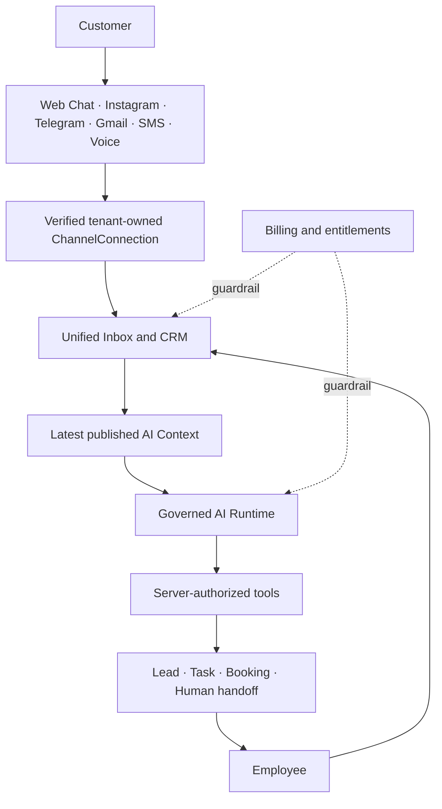
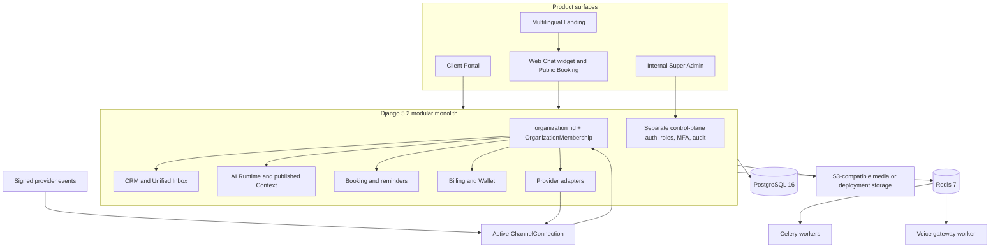

<div align="center">

[English](README.md) · [Русский](README.ru.md) · [O‘zbekcha](README.uz.md)

<picture>
  <source media="(prefers-color-scheme: dark)" srcset="docs/assets/readme/hero-dark.svg">
  <source media="(prefers-color-scheme: light)" srcset="docs/assets/readme/hero-light.svg">
  
</picture>

**Althair AI unifies customer conversations, CRM, governed AI automation, booking, teams, and billing in one tenant-isolated workspace.**

[Live product](https://www.althair-ai.com/) · [3-minute demo](https://www.althair-ai.com/video) · [Documentation](docs/README.md)

<p>
  
  
  
  
  
  
  
  
</p>

</div>

## What Althair does

| | |
| --- | --- |
| **Unified Inbox**<br>Bring Web Chat, Instagram, Telegram, Gmail, SMS, and inbound Voice into one customer timeline. | **CRM**<br>Turn conversations into contacts, leads, follow-up tasks, ownership, and an auditable activity history. |
| **Safe AI Runtime**<br>Draft replies and propose actions against published business context, with server policy, approval, and handoff. | **Booking & Scheduling**<br>Share real availability across employees, public booking, Inbox, AI, and Voice without inventing confirmations. |
| **Omnichannel Communication**<br>Keep channel connections tenant-owned, webhook-verified, idempotent, and explicit about consent and delivery state. | **Billing & Company Wallet**<br>Manage versioned plans, entitlements, invoices, usage, and an immutable non-negative organization ledger. |

## Product tour


[](https://www.althair-ai.com/video)

## From conversation to outcome



Inbound events must resolve an active organization-owned connection before customer content reaches business logic. Billing and entitlements remain backend guardrails, not model choices.

## Platform architecture



Customer APIs stay organization-scoped even for Django superusers. Internal platform roles use separate authentication and cannot bypass customer APIs.

## What is implemented—and what still needs activation

**Legend:** ✅ implemented in this repository · 🧪 deterministic fake/no-network path · ⚙️ deployment configuration · 🔐 credentials, review, or external approval

| Capability | Repository status | Live activation requirement |
| --- | --- | --- |
| Public Web Chat | ✅ 🧪 Tenant-owned widget, sessions, CRM ingestion, SSE/polling | ⚙️ Public enable flag, allowed origins, widget URL; live AI also needs its configured provider |
| Instagram | ✅ 🧪 Messaging, OAuth/webhook boundary, replies, health | 🔐 Meta app credentials, permissions and App Review/Advanced Access where applicable |
| Telegram | ✅ 🧪 Managed bots, signed opaque webhooks, replies, health | 🔐 Manager-bot credentials and public HTTPS webhook configuration |
| Gmail | ✅ 🧪 OAuth, Pub/Sub ingestion, bounded sync, replies | 🔐 Google OAuth verification, Pub/Sub resources and any required security assessment |
| SMS | ✅ 🧪 Twilio SDK signature verification, STOP/START/HELP, delivery callbacks | 🔐 Twilio credentials, number/Messaging Service, carrier and local consent compliance |
| Voice | ✅ 🧪 Inbound Voice AI, Realtime controller, consent and safe tools | 🔐 Twilio/OpenAI credentials, SIP/public HTTPS setup and limited live interoperability validation |
| CRM & Inbox | ✅ Native domain | No external provider required for the internal deterministic channel |
| AI Runtime | ✅ 🧪 Fake provider is the safe default; OpenAI Responses adapter exists | 🔐 Explicit live gate, server API key, model, limits and published AI Context |
| Booking | ✅ 🧪 Shared availability, holds, public booking, reminders, AI/Voice tools | ⚙️ Enable Booking; live reminders reuse a configured consent-aware channel |
| Billing | ✅ 🧪 Provider-independent subscriptions, usage and invoices | ⚙️ Fake/manual only; **no live payment gateway, card collection, tax or fiscalization** |
| Company Wallet | ✅ Immutable tenant ledger and atomic invoice debit | ⚙️ Bootstrap catalog/wallet policy; customer users can view but cannot mutate balance |
| Internal Super Admin | ✅ Separate app, sessions, roles, MFA and audit | ⚙️ Separate admin origin, control-plane enablement and real MFA; fake MFA is dev/test only |

[`/`](https://www.althair-ai.com/) and [`/video`](https://www.althair-ai.com/video) were verified live on 21 August 2026. No Client/Admin, provider, OpenAI, or payment production activation is claimed.

## AI that acts safely

1. Runs use the latest **published**, immutable AI Context and tenant-scoped CRM facts—not drafts or credentials.
2. Customer messages are untrusted. Models propose strict tool calls; they cannot choose tenants or invoke providers.
3. The backend injects organization scope, rechecks policy, validates arguments, and applies approval and idempotency before mutation.
4. A human reply pauses AI and supersedes stale work. Unsupported, sensitive, or explicit human requests create a handoff.
5. Provider bodies, secrets, hidden reasoning, prompts, and chain-of-thought are not exposed through normal APIs or logs.

Read the [AI Runtime architecture](backend/docs/architecture/ai-conversation-runtime.md) and [API contract](backend/docs/api/ai-runtime-api.md).

## Booking that confirms only committed capacity

Employees, Public Booking, Inbox, AI, and Voice share one Booking domain. Availability combines schedules, IANA timezones/DST, breaks, appointments, buffers, holds, and resource capacity. PostgreSQL locks recalculate availability in-transaction, so concurrent contenders cannot win the same slot. Reminders and lifecycle actions are idempotent, and no channel reports a confirmed appointment before the database commit succeeds. See [Booking architecture](backend/docs/booking.md).

## Product screens

<table>
  <tr>
    <td width="50%"><strong>Unified Inbox + governed AI draft</strong><br></td>
    <td width="50%"><strong>Booking + confirmed appointment</strong><br></td>
  </tr>
  <tr>
    <td width="50%"><strong>AI Automation</strong><br></td>
    <td width="50%"><strong>Billing + company Wallet</strong><br></td>
  </tr>
</table>

## Repository map

```text
backend/                 Django modular monolith, workers, provider adapters, tests and API docs
frontend/apps/landing/   Public RU/UZ/EN product site and exact public /video route
frontend/apps/client/    Localized customer workspace, widget and public booking
frontend/apps/admin/     Separately authenticated Internal Super Admin
frontend/packages/       Shared API client, UI, brand and build configuration
docs/                    Public project navigation, local setup and README media
deploy/                  Nginx examples for the production-shaped backend stack
```

## Quick start

Requirements: Docker, Python 3.12, Node.js 24+, Corepack, and pnpm 11.21. Fake providers are the default; local and CI checks need no external credentials.

<details>
<summary><strong>Run the local stack</strong></summary>

```bash
git clone https://github.com/Rakhmatullo929/althair.git
cd althair
cp backend/.env.example .env
# Review local placeholders. Keep .env untracked and never place production secrets here.
docker compose up -d --build
docker compose exec api python manage.py migrate --noinput
docker compose exec api python manage.py bootstrap_platform --check

cd frontend
corepack enable
pnpm install --frozen-lockfile
pnpm dev          # Landing: http://localhost:3000
pnpm dev:client   # Client:  http://localhost:3001 (run in another terminal)
pnpm dev:admin    # Admin:   http://localhost:3002 (run in another terminal)
```

API health: `http://localhost:8000/health/live` and `/health/ready`. Development Swagger is at `http://localhost:8000/swagger/`.

Platform bootstrap accepts a password through a restricted file or stdin and never prints it. `seed_full_demo` is deterministic and only permitted in development/staging/test; production rejects demo seed and reset operations. Follow the exact secret-safe commands in the [local setup guide](docs/development/local-setup.md).

The repository contains Docker Compose and Nginx deployment scaffolding but no `.github/workflows`; no CI status badge or complete CI/CD deployment claim is made here.

</details>

## Going live

Activate providers one at a time with synthetic sandbox traffic and fail-closed health checks:

- [OpenAI Responses runtime](backend/docs/architecture/ai-conversation-runtime.md)
- [Meta Instagram App Review](backend/docs/integrations/instagram-app-review.md)
- [Telegram Managed Bots](backend/docs/integrations/telegram-managed-bots.md)
- [Google Gmail setup and verification](backend/docs/integrations/google-gmail-setup.md)
- [Twilio SMS setup](backend/docs/integrations/twilio-sms-setup.md)
- [Twilio + OpenAI Voice setup](backend/docs/integrations/twilio-openai-voice-setup.md)

Billing deliberately exposes only deterministic fake and reviewed manual adapters today. Choosing and implementing a live payment provider is a separate future stage.

## Documentation

Start with the [documentation map](docs/README.md), then explore [multi-tenancy](backend/docs/architecture/multitenancy.md), [CRM](backend/docs/architecture/crm-core.md), [AI Runtime](backend/docs/architecture/ai-conversation-runtime.md), [Booking](backend/docs/booking.md), [Billing & Wallet](backend/docs/architecture/billing-subscriptions.md), [Public Web Chat](backend/docs/architecture/public-web-chat.md), [Instagram](backend/docs/architecture/instagram-messaging.md), [Telegram](backend/docs/architecture/telegram-managed-bots.md), [Gmail](backend/docs/architecture/gmail-email-integration.md), [SMS](backend/docs/architecture/sms-messaging.md), [Voice](backend/docs/architecture/voice-ai-telephony.md), [Internal Super Admin](backend/docs/architecture/internal-control-plane.md), and the [backend API map](backend/README.md).

## Security

Althair applies organization-scoped querysets, verified destination routing, signed provider webhooks, write-only encrypted provider credentials, idempotent mutations, separate internal authentication with MFA, and repository secret scanning. Platform staff do not gain a customer-session or superuser bypass. Please report vulnerabilities privately using [GitHub Security Advisories](https://github.com/Rakhmatullo929/althair/security/advisories/new); see [SECURITY.md](SECURITY.md) before sharing sensitive details.

---

<div align="center">

Built for service businesses that cannot afford to lose a customer conversation.

[althair-ai.com](https://www.althair-ai.com/) · [Watch the demo](https://www.althair-ai.com/video)

</div>
