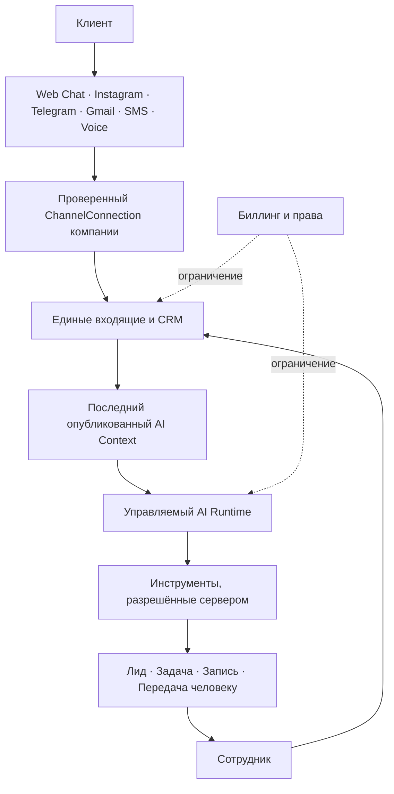
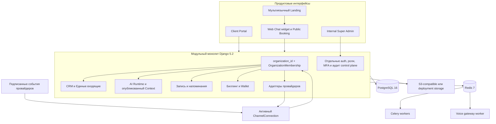

<div align="center">

[English](README.md) · [Русский](README.ru.md) · [O‘zbekcha](README.uz.md)

<picture>
  <source media="(prefers-color-scheme: dark)" srcset="docs/assets/readme/hero-dark.svg">
  <source media="(prefers-color-scheme: light)" srcset="docs/assets/readme/hero-light.svg">
  
</picture>

**Althair AI объединяет обращения клиентов, CRM, управляемую AI-автоматизацию, запись, команду и биллинг в одном изолированном пространстве компании.**

[Работающий продукт](https://www.althair-ai.com/) · [3-минутное демо](https://www.althair-ai.com/video) · [Документация](docs/README.md)

<p>
  
  
  
  
  
  
  
  
</p>

</div>

## Что делает Althair

| | |
| --- | --- |
| **Единые входящие**<br>Web Chat, Instagram, Telegram, Gmail, SMS и входящие Voice-звонки в единой истории клиента. | **CRM**<br>Контакты, лиды, задачи, ответственные и проверяемая лента действий прямо из диалога. |
| **Безопасный AI Runtime**<br>Черновики и предлагаемые действия на основе опубликованного контекста, с политиками сервера, подтверждением и передачей человеку. | **Запись и расписание**<br>Одна реальная доступность для сотрудников, публичной записи, Inbox, AI и Voice — без ложных подтверждений. |
| **Омниканальные коммуникации**<br>Принадлежащие компании подключения, проверенные webhooks, идемпотентность, согласие и честные статусы доставки. | **Биллинг и баланс компании**<br>Версионные тарифы, права, счета, использование и неизменяемый неотрицательный ledger организации. |

## Тур по продукту


Статичный коллаж сохраняет читаемость реального интерфейса и остаётся лёгким GitHub-asset. Все показанные компании, люди, записи и суммы — детерминированные синтетические данные.

[](https://www.althair-ai.com/video)

## От обращения до результата



Компания определяется до передачи клиентского текста в бизнес-логику: входящее событие обязано разрешиться через активное подключение, принадлежащее организации. Биллинг и entitlements — серверные ограничения, а не решения модели.

## Архитектура платформы



Клиентские API сохраняют scope организации даже для Django superuser. Внутренние роли платформы используют отдельную область аутентификации и не дают обхода customer API.

## Что реализовано, а что ещё нужно активировать

**Легенда:** ✅ реализовано в репозитории · 🧪 детерминированный fake/no-network режим · ⚙️ конфигурация deployment · 🔐 credentials, review или внешнее разрешение

| Возможность | Состояние в репозитории | Что требуется для live-режима |
| --- | --- | --- |
| Public Web Chat | ✅ 🧪 Tenant-owned widget, сессии, CRM ingestion, SSE/polling | ⚙️ Флаг публикации, разрешённые origins и widget URL; live AI требует настроенного провайдера |
| Instagram | ✅ 🧪 Сообщения, OAuth/webhook boundary, ответы и health | 🔐 Meta app credentials, permissions и App Review/Advanced Access, когда это требуется |
| Telegram | ✅ 🧪 Managed bots, непрозрачные подписанные webhooks, ответы и health | 🔐 Manager-bot credentials и публичная HTTPS webhook-конфигурация |
| Gmail | ✅ 🧪 OAuth, Pub/Sub ingestion, ограниченная синхронизация и ответы | 🔐 Google OAuth verification, Pub/Sub resources и, при необходимости, security assessment |
| SMS | ✅ 🧪 Проверка подписи Twilio SDK, STOP/START/HELP, delivery callbacks | 🔐 Twilio credentials, номер/Messaging Service, требования операторов и локальные правила согласия |
| Voice | ✅ 🧪 Входящий Voice AI, Realtime controller, consent и безопасные tools | 🔐 Twilio/OpenAI credentials, SIP/public HTTPS и ограниченная live-проверка совместимости |
| CRM и Inbox | ✅ Нативный домен | Для внутреннего детерминированного канала внешний провайдер не нужен |
| AI Runtime | ✅ 🧪 Fake по умолчанию; адаптер OpenAI Responses реализован | 🔐 Явный live gate, server API key, model, limits и опубликованный AI Context |
| Booking | ✅ 🧪 Общая доступность, holds, public booking, reminders, AI/Voice tools | ⚙️ Включить Booking; live reminders используют настроенный consent-aware канал |
| Billing | ✅ 🧪 Provider-independent подписки, usage и invoices | ⚙️ Только fake/manual; **нет live payment gateway, карт, tax или fiscalization** |
| Company Wallet | ✅ Неизменяемый tenant ledger и атомарное списание счета | ⚙️ Bootstrap catalog/wallet policy; клиент видит баланс, но не изменяет его |
| Internal Super Admin | ✅ Отдельное приложение, sessions, roles, MFA и audit | ⚙️ Отдельный admin origin, включение control plane и настоящее MFA; fake MFA только для dev/test |

Публичные Landing и [`/video`](https://www.althair-ai.com/video) проверены в production 21 августа 2026 года. Таблица **не утверждает**, что Client/Admin, какой-либо внешний канал, OpenAI account или платёжная система активны в production.

## AI, который действует безопасно

1. Runtime получает только последнюю **опубликованную** неизменяемую ревизию AI Context и CRM-факты текущей компании; черновики и credentials исключены.
2. Сообщение клиента считается недоверенными данными. Модель предлагает строго типизированный tool call, но не выбирает tenant и не вызывает провайдера напрямую.
3. Backend добавляет organization scope, повторно проверяет роль и политику, валидирует аргументы и применяет approval и idempotency до записи.
4. Ответ сотрудника приостанавливает AI и отменяет устаревшую работу. Чувствительные, неподдерживаемые или явные запросы человека переходят в handoff.
5. Provider payloads, secrets, hidden reasoning, prompts и chain-of-thought не возвращаются обычными API и не попадают в нормальные логи.

Подробнее: [архитектура AI Runtime](backend/docs/architecture/ai-conversation-runtime.md) и [API contract](backend/docs/api/ai-runtime-api.md).

## Запись подтверждает только зафиксированную доступность

Сотрудники, Public Booking, Inbox, AI и Voice используют один домен Booking. Доступность учитывает расписания филиала, специалиста и ресурса, IANA timezone и DST, перерывы, активные записи, buffers, незавершённые holds и capacity. PostgreSQL advisory/row locks повторно рассчитывают слот внутри транзакции, поэтому два конкурентных запроса не могут занять одно место. Reminders, waitlist, перенос, отмена и confirmation tokens идемпотентны; подтверждение не отправляется раньше успешного commit. См. [архитектуру Booking](backend/docs/booking.md).

## Экраны продукта

<table>
  <tr>
    <td width="50%"><strong>Единые входящие + управляемый AI-черновик</strong><br></td>
    <td width="50%"><strong>Запись + подтверждённый визит</strong><br></td>
  </tr>
  <tr>
    <td width="50%"><strong>AI-автоматизация</strong><br></td>
    <td width="50%"><strong>Биллинг + баланс компании</strong><br></td>
  </tr>
</table>

## Карта репозитория

```text
backend/                 Django-монолит, workers, provider adapters, тесты и API docs
frontend/apps/landing/   Публичный RU/UZ/EN сайт и точный маршрут /video
frontend/apps/client/    Локализованный workspace, widget и public booking
frontend/apps/admin/     Отдельно аутентифицируемый Internal Super Admin
frontend/packages/       Общие API client, UI, brand и build configuration
docs/                    Навигация, local setup и README media
deploy/                  Nginx-примеры для production-shaped backend stack
```

## Быстрый старт

Нужны Docker, Python 3.12 для native backend, Node.js 24+, Corepack и pnpm 11.21. Fake-провайдеры включены как безопасный default; CI и локальный запуск не требуют реальных ключей OpenAI, Meta, Google, Telegram или Twilio.

Актуальные команды Docker, migrations, безопасного `bootstrap_platform`, детерминированного `seed_full_demo`, запуска Landing/Client/Admin и полной проверки собраны в [едином local setup guide](docs/development/local-setup.md). Это исключает расхождение трёх языковых README. Локальные URL: Landing `:3000`, Client `:3001`, Admin `:3002`, API `:8000`; реальные пароли задаются только через stdin или закрытый secret file.

В репозитории есть Docker Compose и Nginx deployment scaffolding, но нет `.github/workflows`; поэтому README не показывает CI badge и не заявляет о полном CI/CD deployment.

## Переход в live

Подключайте провайдеры по одному, сначала на синтетическом sandbox traffic и с fail-closed health checks:

- [OpenAI Responses runtime](backend/docs/architecture/ai-conversation-runtime.md)
- [Meta Instagram App Review](backend/docs/integrations/instagram-app-review.md)
- [Telegram Managed Bots](backend/docs/integrations/telegram-managed-bots.md)
- [Google Gmail setup](backend/docs/integrations/google-gmail-setup.md)
- [Twilio SMS setup](backend/docs/integrations/twilio-sms-setup.md)
- [Twilio + OpenAI Voice setup](backend/docs/integrations/twilio-openai-voice-setup.md)

Billing сейчас намеренно содержит только fake и reviewed manual adapters. Выбор и реализация live payment provider — отдельный будущий этап.

## Документация

Начните с [карты документации](docs/README.md): [multi-tenancy](backend/docs/architecture/multitenancy.md), [CRM](backend/docs/architecture/crm-core.md), [AI Runtime](backend/docs/architecture/ai-conversation-runtime.md), [Booking](backend/docs/booking.md), [Billing & Wallet](backend/docs/architecture/billing-subscriptions.md), [Public Web Chat](backend/docs/architecture/public-web-chat.md), [Instagram](backend/docs/architecture/instagram-messaging.md), [Telegram](backend/docs/architecture/telegram-managed-bots.md), [Gmail](backend/docs/architecture/gmail-email-integration.md), [SMS](backend/docs/architecture/sms-messaging.md), [Voice](backend/docs/architecture/voice-ai-telephony.md), [Internal Super Admin](backend/docs/architecture/internal-control-plane.md) и [backend API map](backend/README.md).

## Безопасность

Althair применяет organization-scoped querysets, проверку destination routing, подписанные provider webhooks, write-only encrypted credentials, идемпотентные mutations, отдельную internal authentication с MFA и secret scanning. Platform staff не получают customer session или superuser bypass. Уязвимости сообщайте приватно через [GitHub Security Advisories](https://github.com/Rakhmatullo929/althair/security/advisories/new); перед отправкой чувствительных деталей прочитайте [SECURITY.md](SECURITY.md).

---

<div align="center">

Создано для сервисного бизнеса, который не может позволить себе потерять обращение клиента.

[althair-ai.com](https://www.althair-ai.com/) · [Посмотреть демо](https://www.althair-ai.com/video)

</div>
