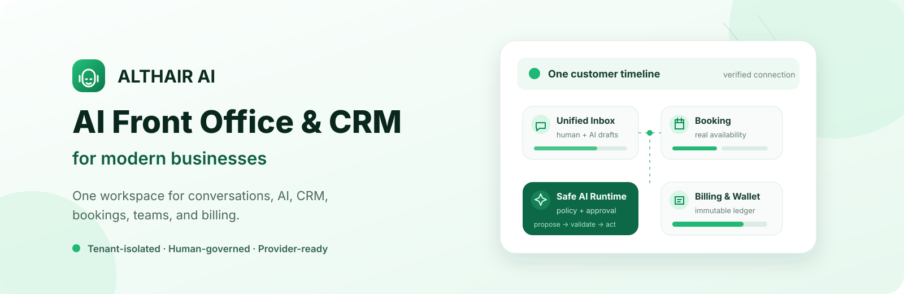
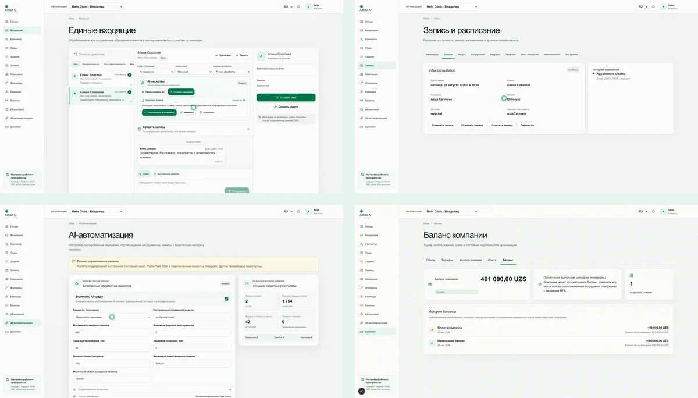
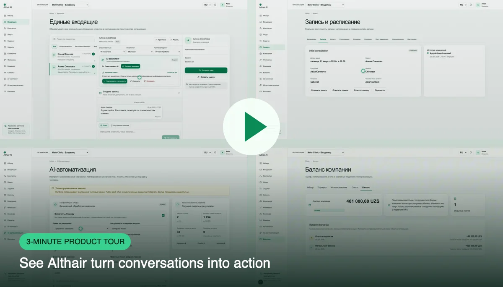
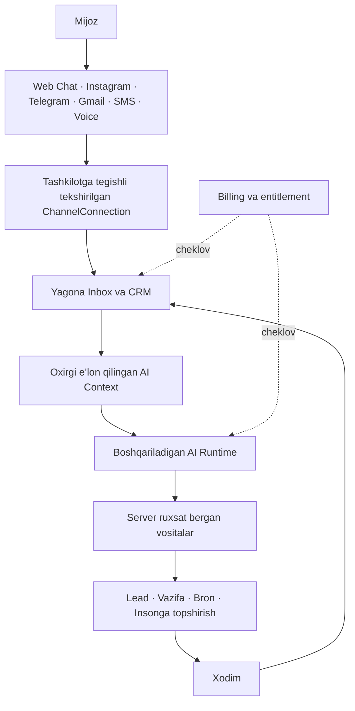
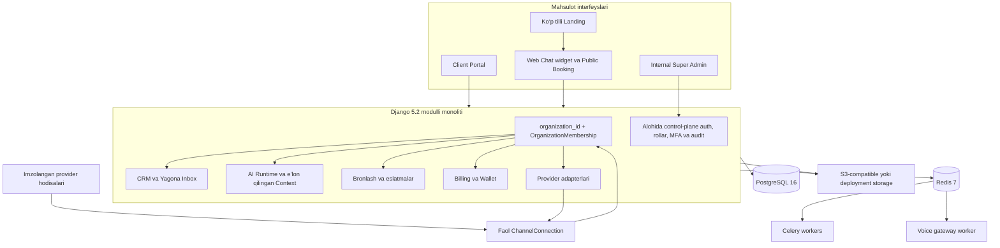
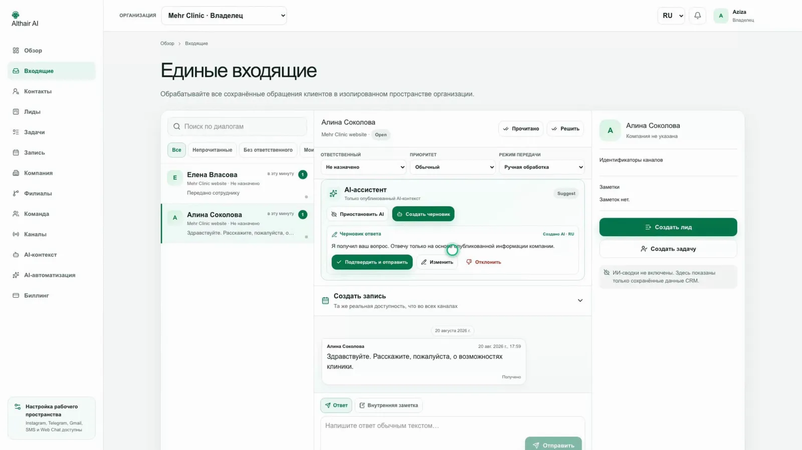
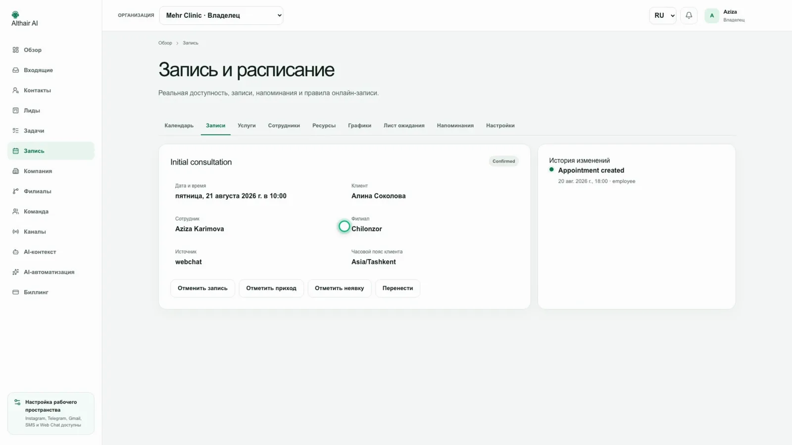
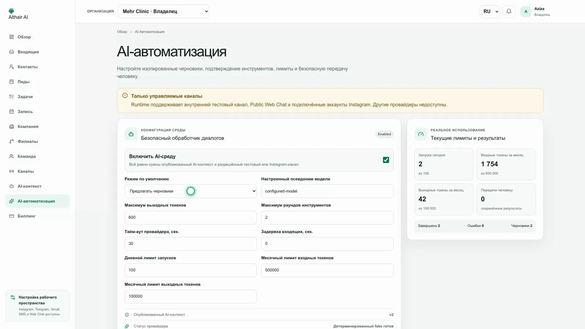
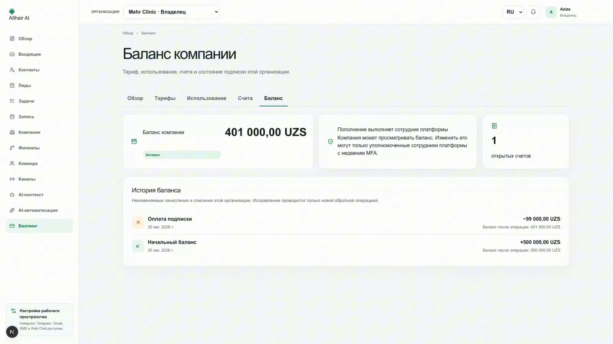

<div align="center">

[English](README.md) · [Русский](README.ru.md) · [O‘zbekcha](README.uz.md)

<picture>
  <source media="(prefers-color-scheme: dark)" srcset="docs/assets/readme/hero-dark.svg">
  <source media="(prefers-color-scheme: light)" srcset="docs/assets/readme/hero-light.svg">
  
</picture>

**Althair AI mijozlar murojaatlari, CRM, boshqariladigan AI avtomatizatsiyasi, bronlash, jamoa va billingni bitta tenant-himoyalangan ish maydonida birlashtiradi.**

[Ishlayotgan mahsulot](https://www.althair-ai.com/) · [3 daqiqalik demo](https://www.althair-ai.com/video) · [Hujjatlar](docs/README.md)

<p>
  
  
  
  
  
  
  
  
</p>

</div>

## Althair nimalar qiladi

| | |
| --- | --- |
| **Yagona Inbox**<br>Web Chat, Instagram, Telegram, Gmail, SMS va kiruvchi Voice qo‘ng‘iroqlarini bitta mijoz tarixida jamlaydi. | **CRM**<br>Suhbatlarni kontakt, lead, keyingi vazifa, mas’ul xodim va tekshiriladigan harakatlar tarixiga aylantiradi. |
| **Xavfsiz AI Runtime**<br>E’lon qilingan biznes kontekstiga tayangan draft va amallarni server siyosati, tasdiqlash hamda insonga topshirish bilan boshqaradi. | **Bronlash va jadval**<br>Xodimlar, ommaviy bronlash, Inbox, AI va Voice uchun bir xil haqiqiy bo‘sh vaqtni ishlatadi; soxta tasdiq bermaydi. |
| **Omnikanal aloqa**<br>Kanal ulanishlarini tashkilotga tegishli, webhook’larni tekshirilgan, amallarni idempotent, consent va delivery statuslarini aniq qiladi. | **Billing va kompaniya Wallet’i**<br>Versiyalangan tariflar, entitlement, hisoblar, foydalanish va o‘zgarmas, manfiy bo‘lmaydigan tashkilot ledger’ini yuritadi. |

## Mahsulot bo‘ylab qisqa tur



Statik to‘rt panelli kollaj haqiqiy interfeys matnini GitHub’da o‘qiladigan saqlaydi va juda kichik asset bo‘lib qoladi. Ko‘rinadigan barcha tashkilotlar, odamlar, uchrashuvlar va balanslar deterministik demo ma’lumotidir.

[](https://www.althair-ai.com/video)

## Murojaatdan natijagacha



Tenant mijoz matni biznes mantiqiga yetmasidan oldin aniqlanadi: kiruvchi hodisa faol, tashkilotga tegishli ulanish orqali topilishi shart. Billing va entitlement — model tanlaydigan amal emas, backend’dagi qat’iy cheklovdir.

## Platforma arxitekturasi



Customer API’lar hatto Django superuser uchun ham tashkilot doirasida qoladi. Ichki platforma rollari alohida autentifikatsiya domenidan foydalanadi va customer API’ni chetlab o‘tish huquqini bermaydi.

## Nima tayyor, nimalar esa hali faollashtirilishi kerak

**Belgilash:** ✅ repository’da tayyor · 🧪 deterministik fake/no-network yo‘li · ⚙️ deployment sozlamasi · 🔐 credential, review yoki tashqi tasdiq

| Imkoniyat | Repository holati | Live ishga tushirish talabi |
| --- | --- | --- |
| Public Web Chat | ✅ 🧪 Tenant-owned widget, sessiyalar, CRM ingestion, SSE/polling | ⚙️ Public enable flag, ruxsat etilgan origin va widget URL; live AI uchun provider ham sozlanadi |
| Instagram | ✅ 🧪 Messaging, OAuth/webhook chegarasi, javoblar va health | 🔐 Meta app credential’lari, permissions va zarur bo‘lsa App Review/Advanced Access |
| Telegram | ✅ 🧪 Managed botlar, opaque imzolangan webhook’lar, javoblar va health | 🔐 Manager-bot credential’lari va ommaviy HTTPS webhook sozlamasi |
| Gmail | ✅ 🧪 OAuth, Pub/Sub ingestion, cheklangan sync va javoblar | 🔐 Google OAuth verification, Pub/Sub resurslari va zarur security assessment |
| SMS | ✅ 🧪 Twilio SDK signature verification, STOP/START/HELP, delivery callbacks | 🔐 Twilio credential’lari, raqam/Messaging Service, operator va mahalliy consent talablari |
| Voice | ✅ 🧪 Kiruvchi Voice AI, Realtime controller, consent va xavfsiz tools | 🔐 Twilio/OpenAI credential’lari, SIP/public HTTPS va cheklangan live interoperability tekshiruvi |
| CRM va Inbox | ✅ Asosiy domen | Ichki deterministik kanal uchun tashqi provider shart emas |
| AI Runtime | ✅ 🧪 Fake — xavfsiz default; OpenAI Responses adapteri mavjud | 🔐 Aniq live gate, server API key, model, limitlar va e’lon qilingan AI Context |
| Booking | ✅ 🧪 Umumiy availability, hold, public booking, reminder, AI/Voice tools | ⚙️ Booking’ni yoqish; live reminder sozlangan consent-aware kanalni ishlatadi |
| Billing | ✅ 🧪 Provider-independent subscription, usage va invoice | ⚙️ Faqat fake/manual; **live payment gateway, karta yig‘ish, tax yoki fiscalization yo‘q** |
| Company Wallet | ✅ O‘zgarmas tenant ledger va atomik invoice debit | ⚙️ Catalog/wallet policy bootstrap’i; customer balansni ko‘radi, o‘zgartira olmaydi |
| Internal Super Admin | ✅ Alohida app, session, role, MFA va audit | ⚙️ Alohida admin origin, control plane enablement va haqiqiy MFA; fake MFA faqat dev/test uchun |

Ommaviy Landing va [`/video`](https://www.althair-ai.com/video) 2026-yil 21-avgust kuni live holatda tekshirildi. Jadval Client/Admin, tashqi provider, OpenAI account yoki to‘lov tizimi production’da faol deb **da’vo qilmaydi**.

## Xavfsiz harakat qiladigan AI

1. Runtime faqat eng so‘nggi **e’lon qilingan**, o‘zgarmas AI Context va joriy tenant’ga tegishli CRM faktlarini oladi; draft va credential kiritilmaydi.
2. Mijoz xabari ishonchsiz ma’lumot hisoblanadi. Model qat’iy tool call taklif qiladi, ammo tenant tanlay olmaydi va provider’ni to‘g‘ridan-to‘g‘ri chaqirmaydi.
3. Backend organization scope’ni qo‘shadi, rol va siyosatni qayta tekshiradi, argumentlarni validatsiya qiladi, so‘ng approval va idempotency qo‘llaydi.
4. Xodim javobi AI’ni to‘xtatadi va eskirgan ishni bekor qiladi. Nozik, qo‘llanmaydigan yoki inson talab qilingan holat handoff yaratadi.
5. Provider payload, secret, hidden reasoning, prompt va chain-of-thought oddiy API yoki log orqali ko‘rsatilmaydi.

Batafsil: [AI Runtime arxitekturasi](backend/docs/architecture/ai-conversation-runtime.md) va [API shartnomasi](backend/docs/api/ai-runtime-api.md).

## Bron faqat commit qilingan sig‘imni tasdiqlaydi

Xodimlar, Public Booking, Inbox, AI va Voice bitta Booking domenidan foydalanadi. Availability filial, xodim va resurs jadvallari, IANA timezone va DST, tanaffus, faol uchrashuv, buffer, tugamagan hold hamda capacity’ni birga hisoblaydi. PostgreSQL advisory/row lock’lari transaction ichida availability’ni qayta tekshiradi, shu bois ikkita parallel so‘rov bir slotni ola olmaydi. Reminder, waitlist, ko‘chirish, bekor qilish va confirmation token’lari idempotent; database commit’dan oldin tasdiq yuborilmaydi. [Booking arxitekturasi](backend/docs/booking.md)ni ko‘ring.

## Mahsulot ekranlari

<table>
  <tr>
    <td width="50%"><strong>Yagona Inbox + boshqariladigan AI draft</strong><br></td>
    <td width="50%"><strong>Bronlash + tasdiqlangan uchrashuv</strong><br></td>
  </tr>
  <tr>
    <td width="50%"><strong>AI Automation</strong><br></td>
    <td width="50%"><strong>Billing + kompaniya Wallet’i</strong><br></td>
  </tr>
</table>

## Repository xaritasi

```text
backend/                 Django monoliti, workers, provider adapters, testlar va API docs
frontend/apps/landing/   Ommaviy RU/UZ/EN sayt va aniq /video route
frontend/apps/client/    Lokalizatsiyalangan workspace, widget va public booking
frontend/apps/admin/     Alohida autentifikatsiyali Internal Super Admin
frontend/packages/       Umumiy API client, UI, brand va build configuration
docs/                    Navigatsiya, local setup va README media
deploy/                  Production-shaped backend uchun Nginx namunalari
```

## Tez boshlash

Docker, native backend uchun Python 3.12, Node.js 24+, Corepack va pnpm 11.21 kerak. Fake provider’lar xavfsiz default: CI va local exploration uchun real OpenAI, Meta, Google, Telegram yoki Twilio credential’lari talab qilinmaydi.

Docker, migration, xavfsiz `bootstrap_platform`, deterministik `seed_full_demo`, Landing/Client/Admin ishga tushirish va barcha tekshiruvlarning joriy buyruqlari yagona [local setup qo‘llanmasida](docs/development/local-setup.md) saqlanadi. Shunda uch tildagi README buyruqlari bir-biridan ajralib ketmaydi. Local URL’lar: Landing `:3000`, Client `:3001`, Admin `:3002`, API `:8000`; parol faqat stdin yoki himoyalangan secret file orqali beriladi.

Repository’da Docker Compose va Nginx deployment scaffolding bor, ammo `.github/workflows` yo‘q; shu sababli README CI badge ko‘rsatmaydi va to‘liq CI/CD deployment tayyor deb da’vo qilmaydi.

## Live rejimga o‘tish

Provider’larni birma-bir, avval sintetik sandbox traffic va fail-closed health check bilan faollashtiring:

- [OpenAI Responses runtime](backend/docs/architecture/ai-conversation-runtime.md)
- [Meta Instagram App Review](backend/docs/integrations/instagram-app-review.md)
- [Telegram Managed Bots](backend/docs/integrations/telegram-managed-bots.md)
- [Google Gmail setup](backend/docs/integrations/google-gmail-setup.md)
- [Twilio SMS setup](backend/docs/integrations/twilio-sms-setup.md)
- [Twilio + OpenAI Voice setup](backend/docs/integrations/twilio-openai-voice-setup.md)

Billing hozir ataylab faqat fake va ko‘rib chiqiladigan manual adapterlarni beradi. Live payment provider tanlash va yozish — alohida kelajak bosqichi.

## Hujjatlar

[Hujjatlar xaritasi](docs/README.md)dan boshlang: [multi-tenancy](backend/docs/architecture/multitenancy.md), [CRM](backend/docs/architecture/crm-core.md), [AI Runtime](backend/docs/architecture/ai-conversation-runtime.md), [Booking](backend/docs/booking.md), [Billing & Wallet](backend/docs/architecture/billing-subscriptions.md), [Public Web Chat](backend/docs/architecture/public-web-chat.md), [Instagram](backend/docs/architecture/instagram-messaging.md), [Telegram](backend/docs/architecture/telegram-managed-bots.md), [Gmail](backend/docs/architecture/gmail-email-integration.md), [SMS](backend/docs/architecture/sms-messaging.md), [Voice](backend/docs/architecture/voice-ai-telephony.md), [Internal Super Admin](backend/docs/architecture/internal-control-plane.md) va [backend API map](backend/README.md).

## Xavfsizlik

Althair organization-scoped queryset, tekshirilgan destination routing, imzolangan provider webhook, write-only encrypted credential, idempotent mutation, MFA’li alohida internal authentication va secret scanning’dan foydalanadi. Platform staff customer session yoki superuser bypass olmaydi. Zaiflik haqida [GitHub Security Advisories](https://github.com/Rakhmatullo929/althair/security/advisories/new) orqali maxfiy xabar bering; nozik ma’lumot yuborishdan oldin [SECURITY.md](SECURITY.md)ni o‘qing.

---

<div align="center">

Birorta mijoz murojaatini yo‘qotishga haqqi yo‘q xizmat ko‘rsatuvchi bizneslar uchun yaratilgan.

[althair-ai.com](https://www.althair-ai.com/) · [Demoni ko‘rish](https://www.althair-ai.com/video)

</div>
